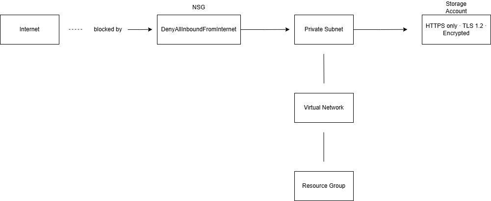
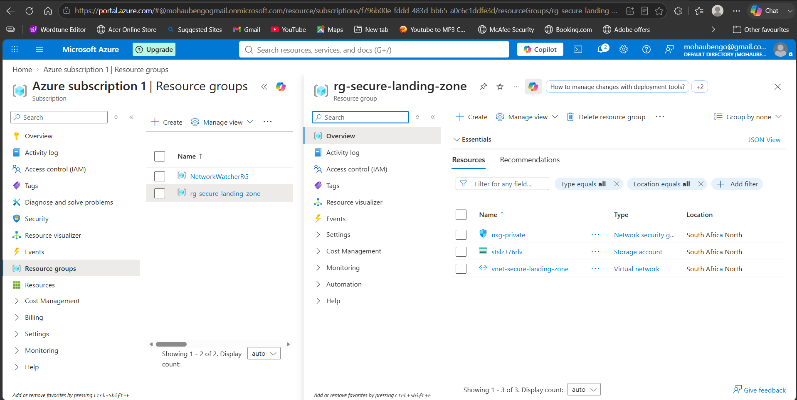
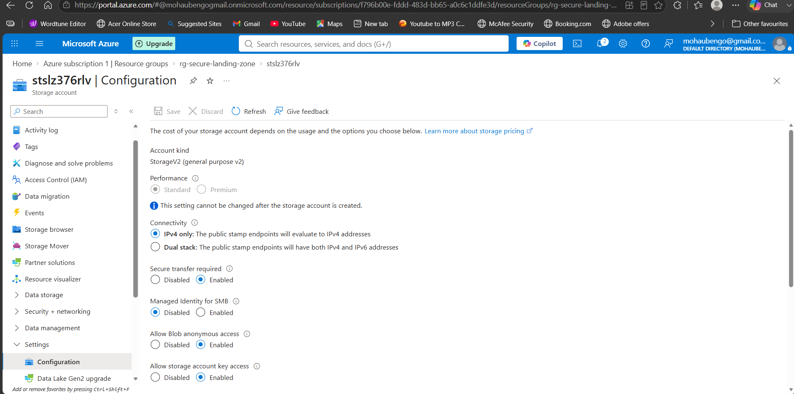
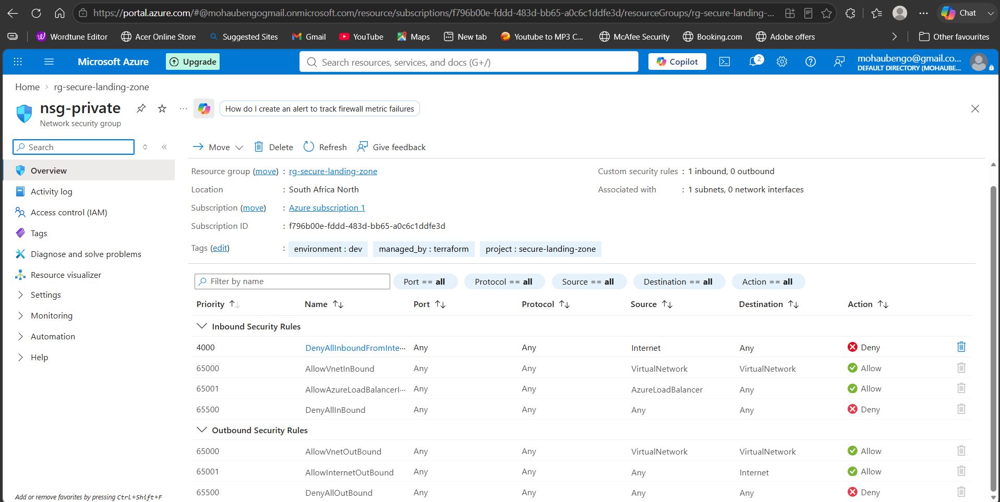

# Azure Secure Landing Zone 🔐

## What this does
Deploys a hardened Azure environment using Terraform. Enforces
encryption on all storage, network segmentation via NSGs that
block all internet inbound traffic, and HTTPS-only connections
on all storage — built as part of my cloud security portfolio.

## The security problem it solves
Most Azure environments are set up manually by clicking through
the portal — which is inconsistent and error-prone. This Terraform
module deploys a secure baseline automatically and consistently
in under 5 minutes, every single time.

## Architecture

## What gets deployed
- Resource Group in South Africa North
- Virtual Network (10.0.0.0/16) with private subnet
- Network Security Group — denies all inbound internet traffic
- Storage Account — HTTPS only, TLS 1.2, encryption at rest enforced
- Tags on every resource for audit tracking

## How to deploy
az login
terraform init
terraform plan
terraform apply

## How to destroy when done
terraform destroy

## What I learned
- Infrastructure as Code means your infrastructure is defined
  in files instead of clicks — consistent, repeatable, auditable
- Every opening curly brace needs a closing one — structure matters
  in Terraform just like grammar matters in English
- Azure NSGs work like a firewall — you define rules that allow
  or deny specific traffic
- Storage accounts need globally unique names — random suffixes solve this
- Always run terraform destroy when done to avoid credit usage

## Tools used
Terraform · Azure CLI · Azure VNet · NSG · Blob Storage · GitHub

## Screenshots
### Resource Group

### Storage Account — Secure Transfer Enabled

### NSG — Deny All Inbound Rule
